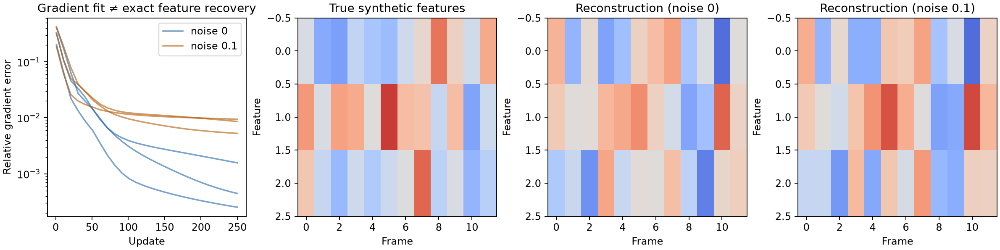

# Federated ASR Gradient Inversion

> **This repository is superseded by [Unsplice](https://github.com/takakhoo/unsplice).**
> The attack here matches gradients by optimisation and does not recover speech (MFCC error 8.78 on its best 10 s run).
> Unsplice recovers the features exactly, in closed form, from the same kind of update: 98.5% of 1,417 LibriSpeech utterances up to 6.2 s at 115 dB feature SNR, and utterances up to 35 s by sequential decoding, with no transcript and no optimisation.
> Audio synthesised from the recovered features is transcribed by Whisper at 3.8% WER and the speaker is identified in 98% of cases.

## What changed

| | This repository (2025) | [Unsplice](https://github.com/takakhoo/unsplice) (2026) |
|---|---|---|
| Method | gradient descent on a dummy input until the output-layer gradient matches | linear algebra on the first-layer gradient; sequential decoding from deeper layers |
| Needs the transcript | yes | no |
| Needs the utterance length | yes | no, it is read from the gradient's rank |
| Model | DeepSpeech-1 with the nonlinearity removed | DeepSpeech-1 with clipped ReLU, Transformer-CTC |
| Longest utterance | 10 s | 35 s |
| MFCC mean absolute error | 8.78 | about 1e-5 |
| Time per utterance | 3,200 s | about 2 s (closed form), about 40 s (sequential) |

Why the old attack stalls: it matches only the output layer, whose gradient has rank at most 29 (one direction per character class). That is far too little to pin down hundreds of frames, so the optimiser finds inputs with the right gradient and the wrong features. Unsplice uses the first layer, whose gradient has one independent direction per frame.

What is still useful here: the twice-differentiable log-space CTC loss (`src/ctc/ctc_loss_imp.py`), which Unsplice keeps as `unsplice/ctc2.py` for its baseline, and the recorded runs under `reports/`.

The original README follows.

---

## Reproduce the numerical/privacy diagnostic on CPU

```bash
python3.13 -m venv .venv
source .venv/bin/activate
pip install -r requirements-cpu.txt
OMP_NUM_THREADS=1 python -m pytest tests -q
OMP_NUM_THREADS=1 python reproduce_cpu.py
```



This is an authorized **synthetic-feature diagnostic**, not speech recovery:
12 frames × 3 generated features, a random tiny convolutional teacher, a known
three-token transcript, and last-layer gradients. Seeds 7, 19 and 41 each run
250 updates with clean gradients and with relative noise 0.1. The
[complete results](reports/cpu-diagnostic/metrics.json) include every sampled
loss/feature-error point; the feature arrays are included alongside the plot.

Clean-gradient relative matching error reaches 0.00025–0.00157, while feature
MAE remains 0.95–1.14. **A good gradient fit is not exact input recovery.** Noise
raises the fit floor in this fixture, but this is not a differential-privacy
mechanism or guarantee, a real ASR benchmark, or an intelligibility result.

### Correctness fixes verified by regression tests

- CTC honors each input/target length, repeated labels and empty transcripts.
  Its values and first derivatives match PyTorch; numerical `gradgradcheck`
  verifies the second derivatives needed for gradient matching. Unreachable
  states no longer introduce NaN curvature. Old implementations remain under
  `src/ctc/legacy_ctc_loss_imp.py` for provenance, not production use.
- Grid updates have hard boundaries, even with Adam momentum/weight decay.
  Optimizer and scheduler states reset between grids; remainder updates are
  allocated instead of dropped. An actual three-grid test verifies update count
  and exact checkpoint resumption.
- `--resume_grids` is now explicit and checks a model/gradient/config signature.
  Old unsigned grid checkpoints cannot be resumed; use a fresh output directory
  to rerun them. Do not mix checkpoints from different teachers or targets.
- L1 regularization is implemented, regularization zeros stay on-device, and
  observed/matched gradients use the same evaluation-mode model state.
- Metrics omit WER without a compatible trained decoder. An invalid checkpoint
  fails instead of silently falling back to random weights.

Seven tests and this CPU diagnostic are run in CI. Full DS1/DS2 GPU experiments,
the external speech dataset, and historical paper figures were **not rerun**.

Research code and recorded artifacts for reconstructing long-form speech features from gradients produced by CTC-based automatic speech recognition models.

This repository accompanies the paper [Long-Form Speech Reconstruction from Gradients in Federated ASR using CTC Loss](https://takakhoo.com/docs/federated-asr-gradient-paper.pdf). It extends an earlier DeepSpeech gradient-matching pipeline with log-space CTC, overlapping temporal grids, per-grid optimizer resets, checkpoints, and analysis tooling.


## Why this project matters

Federated learning keeps raw audio on-device, but the gradients exchanged during training can still encode sensitive information. This project asks whether the non-aligned CTC objective used by speech recognizers is enough to prevent inversion attacks. The experiments show that it is not: an attacker with the model and a client's gradient update can optimize a synthetic MFCC sequence toward the private input.

The engineering challenge is numerical and temporal. Long utterances make CTC gradients unstable and full-sequence optimization difficult. The implementation combines:

- log-space CTC calculations;
- overlapping temporal grids;
- gradient masking so only the active grid is updated;
- per-grid optimizer and learning-rate resets;
- resumable checkpoints and diagnostic plots; and
- quantitative post-processing for MAE, SNR, and transcript checks.

## Repository status

| Surface | Status | Evidence |
|---|---|---|
| Python source | Syntax-checked | All tracked files under `src/` parse successfully |
| CLI and experiment runner | Implemented | `src/main.py` and `run.bash` |
| Recorded 10-second DS1 run | Included | `reports/10second_with_grid_Nov23/` |
| Metrics export | Included | `reports/2025-11-22-long10s/metrics.json` |
| Full GPU reproduction | Environment-bound | Requires CUDA, the LibriSpeech HDF5 subset, and optional model checkpoints |
| Later paper schedules | Paper-only snapshot | The public code currently contains the sequential grid implementation; the paper also reports alternating and error-driven schedules |

The last row is deliberate scope disclosure. This repository should not be read as a one-command reproduction of every table in the paper.

## Recorded baseline

The committed November 2025 artifact uses DeepSpeech1, a 10-second LibriSpeech sample, 300-frame windows with 150-frame overlap, and 1,000 first-order steps per primary window.

| Metric | Recorded value | Interpretation |
|---|---:|---|
| Global MFCC MAE | 8.78 | Feature-space reconstruction error |
| MFCC-space SNR | -0.33 dB | Feature-space error, not waveform SNR |
| Decoder WER | 1.00 | The saved evaluation used a randomly initialized decoder and is not a valid intelligibility result |
| Runtime | 3,200 s | Single recorded long-form run |

These values come directly from [`metrics.json`](reports/2025-11-22-long10s/metrics.json). The negative feature-space SNR and invalid decoder setup are retained as historical limitations. New metrics identify the SNR domain and do not produce a random-decoder WER.

## Quick start

The code targets Linux with an NVIDIA GPU. CPU execution is supported for inspection and small checks but is not practical for the full optimization.

```bash
git clone https://github.com/takakhoo/federated-asr-gradient-inversion.git
cd federated-asr-gradient-inversion

python3 -m venv .venv
source .venv/bin/activate
python -m pip install --upgrade pip
python -m pip install -r requirements.txt
```

The tracked `environment.yml` is the original Linux/CUDA environment snapshot. `requirements.txt` is the portable dependency list; use it for a clean installation on a new machine.

Prepare the expected data layout:

```text
datasets/
└── librispeech_sampled_600_file_0s_4s/
    ├── dataset_item_0.h5
    └── ...
```

Then run a single DS1 reconstruction:

```bash
python src/main.py \
  --model_name ds1 \
  --dataset_path datasets/librispeech_sampled_600_file_0s_4s \
  --batch_start_idx 0 \
  --batch_end_idx 1 \
  --min_duration_ms 0 \
  --max_duration_ms 1000 \
  --learning_rate 0.5 \
  --max_iterations 2000 \
  --context_frames 6 \
  --dropout_prob 0.0
```

For the recorded grid configuration:

```bash
DATASET_PATH=/absolute/path/to/librispeech_long_10s \
MODEL_NAME=ds1 \
MAX_ITERATIONS=4000 \
./run.bash
```

`run.bash` launches one experiment and exposes its main parameters as environment variables. It no longer starts a machine-specific eight-GPU sweep.

## How the pipeline works

```text
private MFCC + transcript
          |
          v
 DeepSpeech + CTC loss
          |
          v
 observed parameter gradients
          |
          v
 initialize synthetic MFCC
          |
          v
 match gradients one temporal grid at a time
          |
          v
 checkpoints, plots, feature metrics, optional decoding
```

The attack matches gradients at the final DeepSpeech layer. In grid mode, each optimization step computes the full model objective but masks the synthetic input gradient outside the active temporal region. Overlap is used to reduce boundary artifacts.

## Repository map

```text
src/main.py                         CLI and experiment orchestration
src/optimize.py                     full-sequence and grid optimization loops
src/ctc/                            CTC implementation
src/models/                         DS1 and DS2 adapters
src/data/                           HDF5 LibriSpeech loading
src/analysis/generate_metrics.py    metrics and reconstruction export
modules/deepspeech/                 vendored DeepSpeech research dependency
reports/                            selected, reviewable experiment artifacts
notebooks/                          exploratory analysis
environment.yml                    original cluster/CUDA snapshot
requirements.txt                   portable Python dependency list
```

## Reproducibility notes

- The dataset and pretrained checkpoints are intentionally not committed.
- Model checkpoints must match the teacher gradients used in a run. Decoding with random weights produces meaningless WER.
- The original experiments were run on Linux/CUDA. Library behavior and runtime will differ on CPU-only hosts.
- The included DeepSpeech dependency is research code, not a maintained production ASR stack.
- Results in the paper and results committed here belong to different experiment snapshots; use the paper for the full comparison and this repository for the public sequential-grid implementation.

## Verification

The lightweight repository check used for this refresh is:

```bash
python -m compileall -q src
bash -n run.bash
```

End-to-end verification additionally requires the external dataset and GPU environment described above. No claim in this README depends on a run that is absent from either `reports/` or the linked paper.

## Responsible research

Gradient inversion can expose information from training participants. Use this code only with data and models you are authorized to test. The purpose of the project is to measure leakage and motivate stronger privacy controls in federated speech systems.

## Citation

```bibtex
@misc{khoo2026federatedasr,
  title  = {Long-Form Speech Reconstruction from Gradients in Federated ASR using CTC Loss},
  author = {Khoo, Taka and Bui, Minh N. and Chin, Peter},
  year   = {2026},
  note   = {Manuscript under revision}
}
```

## License

No repository-wide license has been granted. The code is available for review and research collaboration; third-party components retain their original terms.
